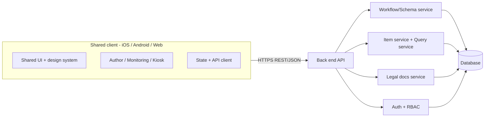
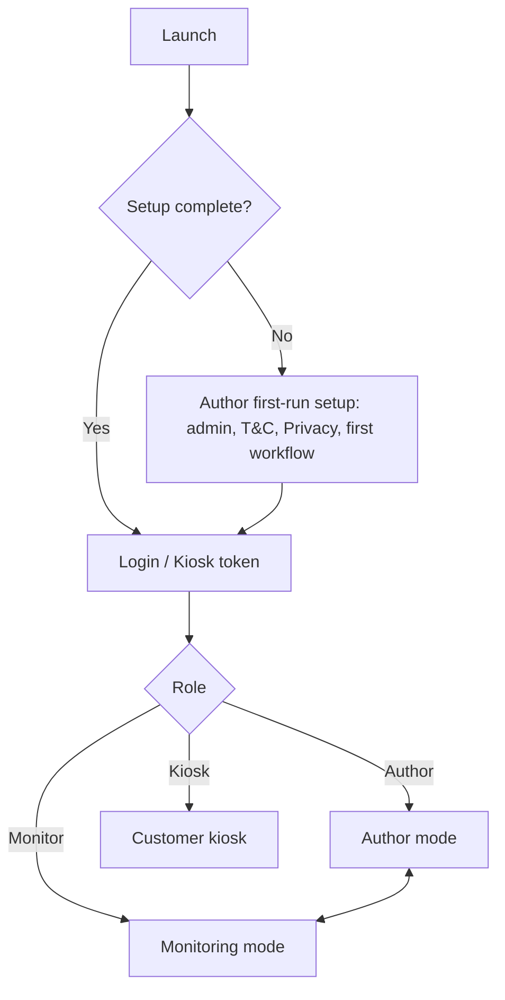

# FlowTracker - Application Design Document

Status: DRAFT for review. No implementation work has started.

## 1. Overview

FlowTracker is a cross-platform application (iOS, Android, Web) with a shared front end and a back end API. All platforms present the same UI and behavior. Users define workflows and forms (Author mode), track items moving through those workflows (Monitoring mode), and collect data from the public through a locked-down kiosk (Customer mode).

## 2. Goals and Non-Goals

Goals
- One codebase and one visual design across iOS, Android, and web.
- Workflows and form definitions are data-driven and editable at runtime.
- Three distinct modes with separate access levels.
- Legal documents (Terms and Conditions, Privacy Policy) managed in the database and shown in Customer mode.

Non-goals (initial release)
- Offline-first sync, multi-tenant billing, native-only features, advanced analytics.

## 3. Modes

### 3.1 Mode 1 - Author
Purpose: define the structure of what is tracked.

Capabilities
- Create, rename, and delete workflows.
- Define workflow stages (statuses) and allowed transitions between them.
- Define fields per workflow (name, type, required, validation, order). This is a high-level schema definition; the back end translates it into data structure changes.
- Define the Customer-mode form (which fields are collected from customers).
- Add or remove items in the form tracker.
- Manage Terms and Conditions and Privacy Policy content (initial setup on first launch, editable later with versioning).
- Manage users and roles.
- First-run setup wizard: create the admin Author account, seed T&C and Privacy Policy, create the first workflow.

Safeguards
- Schema changes are previewed with a diff before applying.
- Destructive changes (removing a field or workflow) require confirmation and are soft-deleted/archived first.
- All definition changes are versioned and audited.

### 3.2 Mode 2 - Monitoring
Purpose: day-to-day tracking of items.

Tabs
1. Flow view
   - Graphical flow diagram of the selected workflow: stages as nodes, transitions as edges.
   - Items are shown as markers on their current stage with status indicators (color/icon).
   - Hover (web/desktop) or long-press/tap (mobile) shows a popover with item details.
   - Click/tap opens the item for viewing and editing.
   - Filters by workflow, status, assignee, date.
2. Items
   - Add new entries (form generated from the workflow's field definitions).
   - Update item data and move items between stages (validated against allowed transitions).
   - History of changes per item.
3. Query editor
   - Search all items and return those matching the query.
   - Input options: a structured query builder (field / operator / value) and an advanced text query language (see 7.3).
   - Results in a table; can open items, save queries, export CSV.
   - Queries are parameterized and read-only; no raw SQL execution.

### 3.3 Mode 3 - Customer (Kiosk)
Purpose: collect data from the public using the form defined in Author mode.

Behavior
- Shows only the data collection form. No navigation to other modes or data.
- A popover/modal presents the Terms and Conditions and the Privacy Policy; acceptance is required before submission and is recorded (document version, timestamp).
- Legal documents are fetched from the database at launch and cached for the session.
- After submission, a confirmation screen is shown, then the form resets for the next user (auto-reset on idle timeout).
- Submissions create new items in the first stage of the configured workflow.
- Exiting kiosk mode requires Author/staff authentication (PIN or login).
- Platform notes: web uses fullscreen kiosk route; iOS uses Guided Access guidance; Android uses screen pinning guidance.

## 4. Architecture

## 5. Proposed Technology (open for review)

| Layer | Proposal | Rationale |
|---|---|---|
| Client | React Native + React Native Web (TypeScript), or Flutter | Single codebase, identical look on all three platforms |
| Flow diagram | React Flow (web) / SVG-based equivalent via react-native-svg | Node/edge graph with hover details |
| Back end | Node.js (TypeScript) with Fastify or NestJS | Shared types with client |
| Database | PostgreSQL | Relational, JSONB support for dynamic fields |
| Auth | Email/password + JWT, optional SSO later | Role-based access |
| Hosting | Azure (App Service/Container Apps, Azure Database for PostgreSQL) | To be confirmed |

## 6. Data Model (high level)

Dynamic schema approach: Author-defined workflows are stored as metadata; item values are stored in a JSONB column validated against the current field definitions. This avoids running DDL on production tables for every author change, while still treating them as "schema changes" at the definition level.

Core tables
- `users` (id, email, password_hash, role, active)
- `workflows` (id, name, description, version, archived)
- `workflow_stages` (id, workflow_id, name, order, color, is_initial, is_terminal)
- `workflow_transitions` (id, workflow_id, from_stage_id, to_stage_id)
- `field_definitions` (id, workflow_id, key, label, type, required, validation, order, show_in_kiosk, archived)
- `items` (id, workflow_id, stage_id, data JSONB, created_by, source [staff|kiosk], created_at, updated_at, deleted_at)
- `item_history` (id, item_id, changed_by, change, timestamp)
- `legal_documents` (id, type [terms|privacy], version, content, active, created_at)
- `consent_records` (id, item_id, terms_version, privacy_version, accepted_at)
- `saved_queries` (id, owner_id, name, definition)
- `audit_log` (id, actor_id, action, entity, details, timestamp)
- `app_settings` (key, value; includes setup_complete flag)

Field types: text, long text, number, date, boolean, single select, multi select, email, phone.

## 7. Back End API (high level)

### 7.1 Endpoints
- Auth: `POST /auth/login`, `POST /auth/refresh`, `POST /auth/logout`
- Setup: `GET /setup/status`, `POST /setup/initialize`
- Author: CRUD on `/workflows`, `/workflows/{id}/stages`, `/transitions`, `/fields`; `POST /workflows/{id}/preview-changes`; `POST /workflows/{id}/publish`
- Legal: `GET /legal/current` (public), `PUT /legal/{type}` (Author)
- Items: `GET/POST /items`, `GET/PATCH/DELETE /items/{id}`, `POST /items/{id}/transition`
- Flow: `GET /workflows/{id}/flow` (stages, transitions, item markers)
- Query: `POST /query`, CRUD `/saved-queries`
- Kiosk: `GET /kiosk/form` (public, limited), `POST /kiosk/submissions` (public, rate limited)

### 7.2 Roles
- Author: full access.
- Monitor: items, flow, queries; no definition changes.
- Kiosk: device token with access only to the two kiosk endpoints and legal documents.

### 7.3 Query language
Simple filter expressions compiled to parameterized SQL by the server, e.g. `status = "Review" AND created > 2026-01-01 AND name contains "Smith"`. Supports AND/OR/NOT, comparison, contains, in, date ranges, sort, and limit.

## 8. UI and Design System

- One component library and theme shared by all platforms; responsive layouts (phone, tablet, desktop).
- Mode switcher in the top-level navigation (visible only to authorized roles); Kiosk has none.
- Hover details on web; long-press/tap equivalent on touch devices.
- Accessibility: WCAG 2.1 AA, screen reader labels, keyboard navigation, status not conveyed by color alone.

## 9. Security and Privacy

- OWASP Top 10 practices: parameterized queries, input validation on server, output encoding, rate limiting, CSRF/CORS controls.
- Passwords hashed with Argon2/bcrypt; short-lived JWTs with refresh tokens.
- TLS everywhere; encryption at rest for the database.
- Kiosk endpoints are isolated, rate limited, and cannot read stored items.
- Consent records retained with legal document version.
- Audit logging for definition and data changes.

## 10. Application Flow

## 11. Testing and Delivery

- Unit tests (client and server), API contract tests, end-to-end tests on web, device tests for iOS and Android.
- CI/CD pipeline building web, iOS, and Android artifacts; database migrations versioned.
- Milestones: (1) foundations and auth, (2) Author mode, (3) Monitoring mode, (4) Kiosk mode, (5) hardening and release.

## 12. Open Questions for Review

1. Client framework: React Native + Web or Flutter?
2. Hosting target: Azure, or other?
3. Is one workflow active at a time, or many concurrently (design assumes many)?
4. Should the Author be able to define a different kiosk form per workflow? (design assumes yes)
5. Are multiple organizations/tenants needed?
6. Required authentication methods (SSO, MFA)?
7. Data retention and deletion requirements for customer submissions (GDPR/CCPA)?
8. Should kiosk work offline and sync later?
9. Notifications (email/push) on stage changes?
10. Should the query editor support full text and cross-workflow queries?
