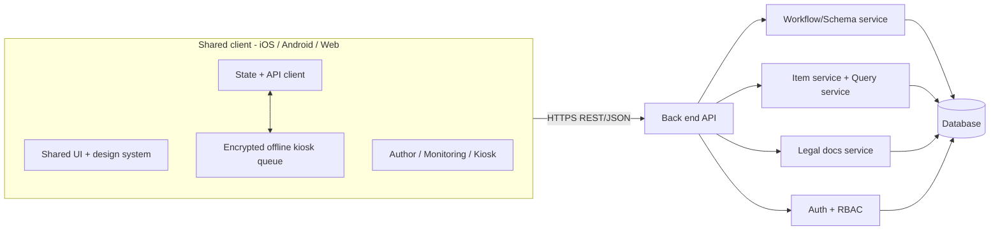
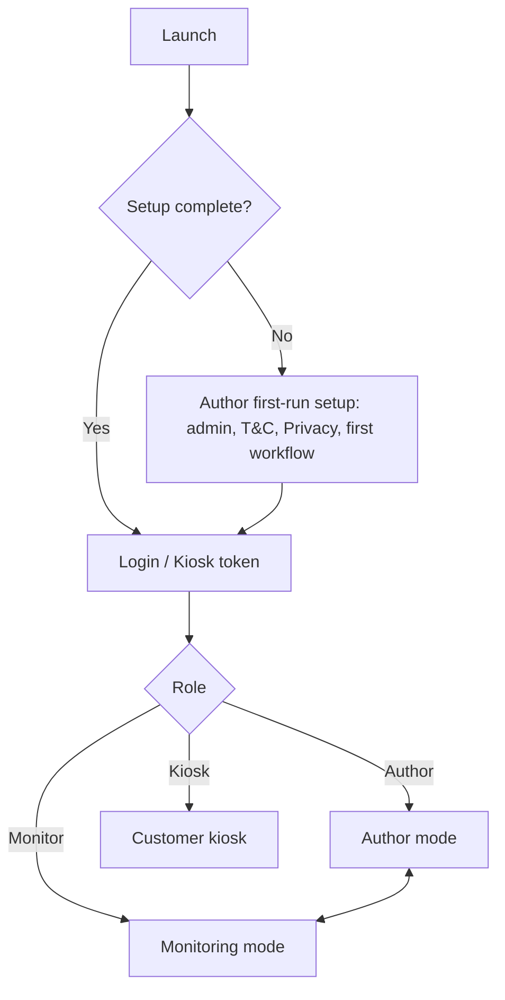

# grasdo - Application Design Document

Status: DRAFT for review. No implementation work has started.

## 1. Overview

grasdo is a cross-platform application (iOS, Android, Web) with a shared front end and a back end API. All platforms present the same UI and behavior. Users define workflows and forms (Author mode), track items moving through those workflows (Monitoring mode), and collect data from the public through a locked-down kiosk (Customer mode).

### 1.1 Application name and future renaming

The current application name is **grasdo**, chosen because a matching domain was available. The name may change based on customer feedback.

Keep the display name, branding assets, and public domain configuration centralized so a future rename can be applied consistently across web, iOS, Android, kiosk screens, legal documents, and customer communications. Keep workflow IDs, stored data, and API contracts independent of the application name. A future rename must include a migration plan for domains, links, and platform identifiers where needed, preserving customer access and existing data.

## 2. Goals and Non-Goals

Goals
- One codebase and one visual design across iOS, Android, and web.
- Workflows and form definitions are data-driven and editable at runtime.
- Support many active workflows concurrently, starting with one workflow design by default.
- Three distinct modes with separate access levels.
- Legal documents (Terms and Conditions, Privacy Policy) managed in the database and shown in Customer mode.
- Plan for SaaS deployment; whether to support multiple organizations/tenants and how to isolate them remain undecided.
- Support offline kiosk collection on iPad and Android tablets, with durable local storage and later upload.
- Meet applicable GDPR/CCPA retention and deletion requirements, including a deletion-request path for anyone who provided consent or submitted personal data.

Non-goals (initial release)
- Offline editing/sync for Author and Monitoring modes, multi-tenant billing, native-only features unrelated to kiosk collection, advanced analytics.

## 3. Modes

### 3.1 Mode 1 - Author
Purpose: define the structure of what is tracked.

Capabilities
- Create, rename, and delete workflows.
- Show all active workflows in the workflow list so Authors can select any workflow to design or edit.
- Define workflow stages (statuses) and allowed transitions between them.
- Define fields per workflow (name, type, required, validation, order). This is a high-level schema definition; the back end translates it into data structure changes.
- Define one Customer-mode kiosk per workflow, including its form (which fields are collected from customers).
- Add or remove items in the form tracker.
- Manage Terms and Conditions and Privacy Policy content (initial setup on first launch, editable later with versioning).
- Manage users and roles.
- First-run setup wizard: create the admin Author account, seed T&C and Privacy Policy, create the first workflow.
- First-run setup creates one active workflow by default; Authors can add further workflows without deactivating existing ones.

Safeguards
- Schema changes are previewed with a diff before applying.
- Destructive changes (removing a field or workflow) require confirmation and are soft-deleted/archived first.
- All definition changes are versioned and audited.

### 3.2 Mode 2 - Monitoring
Purpose: day-to-day tracking of items.

All active workflows are visible in the workflow list for tracking. Selecting a workflow opens its flow and items; multiple workflows remain active concurrently.

Tabs
1. Flow view
   - Graphical flow diagram of the selected workflow: stages as nodes, transitions as edges.
   - Items are shown as markers on their current stage with status indicators (color/icon).
   - Hover (web/desktop) or long-press/tap (mobile) shows a popover with item details.
   - Click/tap opens the item for viewing and editing.
   - Filters by workflow, status, assignee, date.
2. Items
   - Add new entries (form generated from the workflow's field definitions).
   - Update item data and move items between stages (validated against allowed transitions).
   - History of changes per item.
3. Query editor
   - Search all items and return those matching the query.
   - Input options: a structured query builder (field / operator / value) and an advanced text query language (see 7.3).
   - Results in a table; can open items, save queries, export CSV.
   - Queries are parameterized and read-only; no raw SQL execution.

### 3.3 Mode 3 - Customer (Kiosk)
Purpose: collect data from the public using the form defined in Author mode.

Behavior
- Each workflow has one Author-defined kiosk form. Each kiosk session is bound to a single workflow and displays that workflow's form.
- Shows only the data collection form. No navigation to other modes or data.
- A popover/modal presents the Terms and Conditions and the Privacy Policy; acceptance is required before submission and is recorded (document version, timestamp).
- Before offline use, staff provision the tablet while connected, downloading the workflow's versioned form and legal documents. Persist these locally so a provisioned kiosk can launch without a connection; an unprovisioned device cannot collect offline.
- After submission, a confirmation screen is shown, then the form resets for the next user (auto-reset on idle timeout).
- Online submissions create new items in the first stage of the configured workflow. Offline submissions are saved durably in an encrypted local queue, including a unique submission ID, workflow/form version, legal document versions, consent timestamp, and collected data; confirmation distinguishes local saving from server receipt.
- Upload queued submissions when connectivity returns, with automatic retry and a staff-triggered upload option. The server deduplicates by submission ID and acknowledges each accepted submission; remove local personal data only after acknowledgement. Pending data survives application restarts, is inaccessible to subsequent customers, and cannot be discarded by the form's idle reset.
- Validate uploads against their captured form version; incompatible or rejected submissions remain queued for staff resolution. Require valid device authorization for upload and reconcile pending deletion requests before accepting queued data so deleted data is not reintroduced.
- Exiting kiosk mode requires Author/staff authentication (PIN or login).
- Platform notes: web uses fullscreen kiosk route; iOS uses Guided Access guidance; Android uses screen pinning guidance.

## 4. Architecture

## 5. Proposed Technology (open for review)

| Layer | Proposal | Rationale |
|---|---|---|
| Client | React Native + React Native Web (TypeScript) — selected | Shared client codebase and visual design across iOS, Android, and web |
| Flow diagram | React Flow (web) / SVG-based equivalent via react-native-svg | Node/edge graph with hover details |
| Back end | Node.js (TypeScript) with Fastify or NestJS | Shared types with client |
| Database | PostgreSQL | Relational, JSONB support for dynamic fields |
| Auth | TBD; email/password + JWT is a provisional proposal | Role-based access required; authentication methods to be decided later |
| Hosting | Docker containers on a self-hosted Linux VPS, managed with Docker Compose | Self-managed deployment with persistent storage and no cloud-provider dependency |

### 5.1 VPS deployment

- Target a minimum-cost VPS with **1 vCPU and 2 GB RAM** for the initial deployment. Keep the API, PostgreSQL, and reverse proxy within this resource budget; build application artifacts and container images in CI rather than on the VPS.
- Use bounded database connection pools, paginated item/query results, and container memory limits to control resource use. Validate the deployment on the target VPS size with representative concurrent workflows and users before release.
- Run the back end API in an application container. Serve the built web client through a reverse proxy container (Caddy or Nginx), which routes API requests to the back end and terminates HTTPS with automated certificate renewal. iOS and Android apps connect to the same public HTTPS API.
- Run PostgreSQL in a separate container on a private Docker network. Only the reverse proxy exposes public application ports (80/443); the API and database are not exposed directly.
- Use Docker Compose to define services, private networks, health checks, restart policies, and persistent volumes. Store database data in a persistent volume that survives container replacement.
- Keep production secrets outside source control and container images; provide them through protected files on the VPS. Restrict administrative access to SSH keys and configure the host firewall.
- Encrypt database storage and backups using host-level disk encryption and encrypted backup archives. Schedule database backups to storage outside the VPS and periodically verify restoration.
- Build versioned application images in CI, deploy a selected image version to the VPS, and run versioned database migrations during deployment. Retain the previous image for rollback; database changes require a compatible migration or a tested restore plan.
- Monitor container health, application logs, disk space, and backup results. The operator is responsible for VPS updates, container updates, certificates, and recovery. The initial deployment uses one VPS, so a host outage interrupts service until recovery.

## 6. Data Model (high level)

SaaS tenancy is undecided. The tables below describe the functional model; organization ownership, tenant isolation, and deployment boundaries must be resolved before a shared multi-tenant SaaS release.

Dynamic schema approach: Author-defined workflows are stored as metadata; item values are stored in a JSONB column validated against the current field definitions. This avoids running DDL on production tables for every author change, while still treating them as "schema changes" at the definition level.

Core tables
- `users` (id, email, password_hash, role, active)
- `workflows` (id, name, description, version, archived)
- `workflow_stages` (id, workflow_id, name, order, color, is_initial, is_terminal)
- `workflow_transitions` (id, workflow_id, from_stage_id, to_stage_id)
- `field_definitions` (id, workflow_id, key, label, type, required, validation, order, show_in_kiosk, archived)
- `items` (id, workflow_id, stage_id, data JSONB, created_by, source [staff|kiosk], submission_id [unique for kiosk deduplication], form_version, created_at, updated_at, deleted_at)
- `item_history` (id, item_id, changed_by, change, timestamp)
- `legal_documents` (id, type [terms|privacy], version, content, active, created_at)
- `consent_records` (id, item_id, terms_version, privacy_version, accepted_at)
- `saved_queries` (id, owner_id, name, definition)
- `audit_log` (id, actor_id, action, entity, details, timestamp)
- `app_settings` (key, value; includes setup_complete flag)
- `deletion_requests` (id, subject_reference, requested_at, verification_status, status, due_at, completed_at, exception_reason); retain only the minimum request metadata needed.

Offline tablets maintain an encrypted persistent submission queue and cached versioned forms/legal documents. Local storage technology and device provisioning details remain implementation decisions.

Field types: text, long text, number, date, boolean, single select, multi select, email, phone.

## 7. Back End API (high level)

### 7.1 Endpoints
- Auth: `POST /auth/login`, `POST /auth/refresh`, `POST /auth/logout`
- Setup: `GET /setup/status`, `POST /setup/initialize`
- Author: CRUD on `/workflows`, `/workflows/{id}/stages`, `/transitions`, `/fields`; `POST /workflows/{id}/preview-changes`; `POST /workflows/{id}/publish`
- Legal: `GET /legal/current` (public), `PUT /legal/{type}` (Author)
- Items: `GET/POST /items`, `GET/PATCH/DELETE /items/{id}`, `POST /items/{id}/transition`
- Flow: `GET /workflows/{id}/flow` (stages, transitions, item markers)
- Query: `POST /query`, CRUD `/saved-queries`
- Kiosk: `GET /kiosk/form` (public, limited), `POST /kiosk/submissions` (public, rate limited)
- Privacy: `POST /privacy/deletion-requests` (accessible without a staff account, rate limited); authorized staff review and process requests through restricted endpoints. Verification must not reveal whether someone else's data exists.

### 7.2 Roles
- Author: full access.
- Monitor: items, flow, queries; no definition changes.
- Kiosk: device token bound to one workflow, with access only to that workflow's kiosk form and submissions through the two kiosk endpoints, plus legal documents. The server derives the workflow from the token for both form retrieval and submission.

### 7.3 Query language
Simple filter expressions compiled to parameterized SQL by the server, e.g. `status = "Review" AND created > 2026-01-01 AND name contains "Smith"`. Supports AND/OR/NOT, comparison, contains, in, date ranges, sort, and limit.

## 8. UI and Design System

- One React Native component library and theme shared by all platforms, with React Native Web rendering the web client; responsive layouts (phone, tablet, desktop).
- Mode switcher in the top-level navigation (visible only to authorized roles); Kiosk has none.
- Author and Monitoring modes show all active workflows in a shared workflow list, with selection opening the workflow for design or tracking according to the user's role. The initial list contains one workflow by default; archived workflows are excluded from the active list.
- Hover details on web; long-press/tap equivalent on touch devices.
- Accessibility: WCAG 2.1 AA, screen reader labels, keyboard navigation, status not conveyed by color alone.

## 9. Security and Privacy

- OWASP Top 10 practices: parameterized queries, input validation on server, output encoding, rate limiting, CSRF/CORS controls.
- Authentication methods remain deferred. If password/JWT authentication is selected, hash passwords with Argon2/bcrypt and use short-lived access tokens with refresh tokens.
- TLS everywhere; encryption at rest for the database.
- Kiosk endpoints are isolated, rate limited, and cannot read stored items.
- Consent records retained with legal document version.
- Audit logging for definition and data changes.

### 9.1 Retention and deletion

- Define documented retention periods by data category and purpose, retain personal data only as long as necessary, and run scheduled deletion jobs. Exact periods and any required exceptions must be determined before release under applicable GDPR/CCPA requirements.
- Provide a clearly visible deletion-request route in the privacy policy and customer confirmation flow, usable without a staff login. Anyone who consented or submitted personal data can request removal; verify identity proportionately, acknowledge the request, track applicable response deadlines, and communicate completion or a documented legal exception.
- Erasure must cover personal data in items, histories, consent records, logs, caches, tablet queues, and downstream processors. Soft deletion alone does not fulfill erasure; permanently delete or irreversibly anonymize data except where a documented legal obligation requires restricted retention.
- Apply a documented backup expiry policy and reapply completed deletions before restored data is served. Reconnecting tablets must reconcile deletions before upload; track device cleanup so disconnected queues cannot silently recreate erased records. Keep only minimal protected deletion metadata necessary to enforce this.
- Retention and erasure policy references: [European Commission GDPR principles](https://commission.europa.eu/law/law-topic/data-protection/information-business-and-organisations/principles-gdpr_en), [GDPR rights requests](https://commission.europa.eu/law/law-topic/data-protection/information-business-and-organisations/dealing-requests-individuals_en), and [California Attorney General CCPA guidance](https://oag.ca.gov/privacy/ccpa).

## 10. Application Flow

## 11. Testing and Delivery

- Unit tests (client and server), API contract tests, end-to-end tests on web, device tests for iOS and Android.
- Verify offline kiosk launch after provisioning, durable collection across restarts, retry/deduplication after interrupted uploads, version mismatch handling, and deletion reconciliation on iPad and Android tablets. Verify erasure across stores and after backup restoration.
- CI/CD pipeline building web, iOS, and Android artifacts and versioned container images; database migrations versioned. Deploy the web client and API to the self-hosted VPS using Docker Compose, with deployment health checks and a documented backup/restore procedure.
- Milestones: (1) foundations and auth, (2) Author mode, (3) Monitoring mode, (4) Kiosk mode, (5) hardening and release.

## 12. Open Questions for Review

1. Client framework: **Resolved — React Native + React Native Web (TypeScript)** for iOS, Android, and web.
2. VPS sizing: **Resolved - target 1 vCPU and 2 GB RAM to minimize costs.** Domain name and off-server backup destination remain open.
3. Concurrent workflows: **Resolved - many workflows may be active at once, with one workflow design by default.** All active workflows are visible for tracking in Monitoring mode and for design in Author mode.
4. Kiosk per workflow: **Resolved - the Author can define one kiosk per workflow, with its own data collection form.** Submissions belong to that workflow.
5. SaaS deployment is planned. **Open - whether multiple organizations/tenants are required and the tenancy/isolation model remain to be determined.**
6. Required authentication methods (SSO, MFA): **Deferred - to be updated later.** Current authentication proposals are provisional.
7. Retention and deletion: **Requirement confirmed - follow applicable GDPR/CCPA requirements and allow anyone who consented or submitted personal data to request removal from data stores.** Detailed retention periods, verification, and exception policies remain to be defined before release (see 9.1).
8. Offline kiosk: **Resolved - support collection without connectivity on iPad or Android tablets using a durable local instance/queue, then upload later when connected.** See 3.3 for provisioning and synchronization behavior.
9. Notifications (email/push) on stage changes?
10. Should the query editor support full text and cross-workflow queries?
